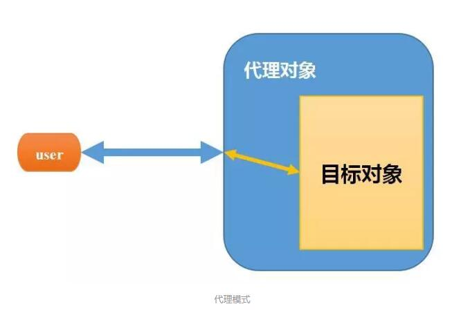

# javaBaseStudy

## java-proxy

什么是**代理**：

在Java设计模式中，代理模式是这样定义的：给某个对象提供一个代理对象，并由代理对象控制原对象的引用。

　　可能大家不太明白这句话，在举一个现实生活中的例子：比如我们要买一间二手房，虽然我们可以自己去找房源，但是这太花费时间精力了，而且房屋质量检测以及房屋过户等一系列手续也都得我们去办，再说现在这个社会，等我们找到房源，说不定房子都已经涨价了，那么怎么办呢？最简单快捷的方法就是找二手房中介公司（为什么？别人那里房源多啊），于是我们就委托中介公司来给我找合适的房子，以及后续的质量检测过户等操作，我们只需要选好自己想要的房子，然后交钱就行了。

　　代理简单来说，就是如果我们想做什么，但又不想直接去做，那么这时候就找另外一个人帮我们去做。那么这个例子里面的中介公司就是给我们做代理服务的，我们委托中介公司帮我们找房子。

- java常用的代理模式
  - ***JDK***提供的动态代理
  - ***cglib***动态代理

## java-reflect

什么是**反射**：

正常情况下我们新建一个类就是：

~~~java
Student st = new Student()
~~~

通过new方式，调用默认构造方法新建一个类，加载到jvm虚拟机中，这种类的加载方法存在一种问题，就是运行时不灵活，如果我像吧student类换成teacher类，就需要重新修改代码。

而java的反射机制提供了一种方法，在程序运行时动态加载所需要的类

~~~java
Class c1 = Class.forName("com.cyh.test.Teacher");
//创建此Class对象所表示类的一个新实例,
 //newInstance方法调用的是Teacher的空参数构造方法
Object o = c1.newInstance();
~~~

类路径可以从配置文件加载，从而实现不需要修改代码，实现类的替换

除此之外，还可以根据反射特性，对于任意一个类。都能都知道这个类的所有属性和方法，对于任意一个对象，都能够调用它的任意一个方法和属

- java基础知识 - 反射原理
- 反射获取注解的基础demo

## java-validCode

- 纯java代码实现图像验证码
- 添加干扰线等