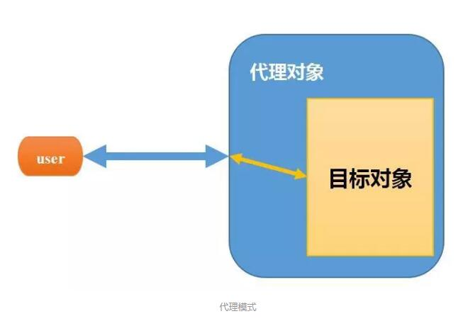

# javaBaseStudy

## java-proxy

什么是**代理**：

在Java设计模式中，代理模式是这样定义的：给某个对象提供一个代理对象，并由代理对象控制原对象的引用。

　　可能大家不太明白这句话，在举一个现实生活中的例子：比如我们要买一间二手房，虽然我们可以自己去找房源，但是这太花费时间精力了，而且房屋质量检测以及房屋过户等一系列手续也都得我们去办，再说现在这个社会，等我们找到房源，说不定房子都已经涨价了，那么怎么办呢？最简单快捷的方法就是找二手房中介公司（为什么？别人那里房源多啊），于是我们就委托中介公司来给我找合适的房子，以及后续的质量检测过户等操作，我们只需要选好自己想要的房子，然后交钱就行了。

　　代理简单来说，就是如果我们想做什么，但又不想直接去做，那么这时候就找另外一个人帮我们去做。那么这个例子里面的中介公司就是给我们做代理服务的，我们委托中介公司帮我们找房子。

- java常用的代理模式
  - ***JDK***提供的动态代理
  - ***cglib***动态代理

## java-reflect

什么是**反射**：

正常情况下我们新建一个类就是：

~~~java
Student st = new Student()
~~~

通过new方式，调用默认构造方法新建一个类，加载到jvm虚拟机中，这种类的加载方法存在一种问题，就是运行时不灵活，如果我们把student类换成teacher类，就需要重新修改代码。

而java的反射机制提供了一种方法，在程序运行时动态加载所需要的类

~~~java
Class c1 = Class.forName("com.cyh.test.Teacher");
//创建此Class对象所表示类的一个新实例,
 //newInstance方法调用的是Teacher的空参数构造方法
Object o = c1.newInstance();
~~~

类路径可以从配置文件加载，从而实现不需要修改代码，实现类的替换

除此之外，还可以根据反射特性，对于任意一个类。都能都知道这个类的所有属性和方法，对于任意一个对象，都能够调用它的任意一个方法和属

- java基础知识 - 反射原理
- 反射获取注解的基础demo

## java-validCode

- 纯java代码实现图像验证码
- 添加干扰线等

## java-serializbzle

Java 序列化是 JDK 1.1 时引入的一组开创性的特性，用于将 Java 对象转换为字节数组，便于存储或传输。此后，仍然可以将字节数组转换回 Java 对象原有的状态。

序列化的思想是“冻结”对象状态，然后写到磁盘或者在网络中传输；反序列化的思想是“解冻”对象状态，重新获得可用的 Java 对象。

但是点开序列化 `Serializbale` 接口的定义，会发现这个是一个空接口

> [参考文章](https://mp.weixin.qq.com/s/qV9Ius76bo7GIKu0S-XZQA)

* 实例

  * 创建一个`People`类（只有两个字段，和对应的 `getter/setter`），用于序列化和反序列化

  * 创建一个测试类，通过 `ObjectOutputStream` 将“18 岁的王二”写入到文件当中，实际上就是一种序列化的过程；再通过 `ObjectInputStream` 将“18 岁的王二”从文件中读出来，实际上就是一种反序列化的过程。

  ~~~java
  public static void main(String[] args) {
          // 初始化
          People wanger = new People();
          wanger.setName("王二");
          wanger.setAge(18);
          System.out.println(wanger);
  
          // 把对象写到文件中
          try (ObjectOutputStream oos = new ObjectOutputStream(new FileOutputStream("chenmo"));){
              oos.writeObject(wanger);
          } catch (IOException e) {
              e.printStackTrace();
          }
  
          // 从文件中读出对象
          try (ObjectInputStream ois = new ObjectInputStream(new FileInputStream(new File("chenmo")));){
              People wanger1 = (People) ois.readObject();
              System.out.println(wanger1);
          } catch (IOException | ClassNotFoundException e) {
              e.printStackTrace();
          }
      }
  ~~~

  

  * 由于没有实现`Serializbale` 接口，运行过程中会报错

  ~~~properties
  com.cyn.bean.People@28d93b30
  java.io.NotSerializableException: com.cyn.bean.People
  	at java.io.ObjectOutputStream.writeObject0(ObjectOutputStream.java:1184)
  	at java.io.ObjectOutputStream.writeObject(ObjectOutputStream.java:348)
  	at com.cyn.bean.TestMain.main(TestMain.java:25)
  java.io.WriteAbortedException: writing aborted; java.io.NotSerializableException: com.cyn.bean.People
  	at java.io.ObjectInputStream.readObject0(ObjectInputStream.java:1355)
  	at java.io.ObjectInputStream.readObject(ObjectInputStream.java:371)
  	at com.cyn.bean.TestMain.main(TestMain.java:32)
  Caused by: java.io.NotSerializableException: com.cyn.bean.People
  	at java.io.ObjectOutputStream.writeObject0(ObjectOutputStream.java:1184)
  	at java.io.ObjectOutputStream.writeObject(ObjectOutputStream.java:348)
  	at com.cyn.bean.TestMain.main(TestMain.java:25)
  
  ~~~

  * 添加接口实现后，正常序列化和反序列化

  * 序列化和反序列的实现过程

    * ObjectOutputStream 序列化

      跟进ObjectOutputStream源码会发现，序列化时会判断被序列化的对象是哪一种类型

      ~~~java
      if (obj instanceof String) {
          writeString((String) obj, unshared);
      } else if (cl.isArray()) {
          writeArray(obj, desc, unshared);
      } else if (obj instanceof Enum) {
          writeEnum((Enum<?>) obj, desc, unshared);
      } else if (obj instanceof Serializable) {
          writeOrdinaryObject(obj, desc, unshared);
      } else {
          if (extendedDebugInfo) {
              throw new NotSerializableException(
                  cl.getName() + "\n" + debugInfoStack.toString());
          } else {
              throw new NotSerializableException(cl.getName());
          }
      }
      ~~~

    * 被序列化的类实现`Serializable` 接口

      实现序列化，依次调用`writeObject()`→`writeObject0()`→`writeOrdinaryObject()`→`writeSerialData()`→`invokeWriteObject()`→`defaultWriteFields()`。

    * 反序列化反向执行上述过程

* 序列化注意点

  * 不会被序列化的字段`static` 和 `transient`

    * `static` 修饰的字段，序列化前为变化，序列化后，如果字段发生变化。反序列后，该字段不会保留序列化前的状态，因为`static` 修饰的字段属于类的状态，反序列化时，会根据当前类状态变化。

    * `transient`修饰的字段，属于临时字段，`meizi` 的值为“王三”，反序列化后，`meizi` 的值为 `null。`

      `transient` 的中文字义为“临时的”（论英语的重要性），它可以阻止字段被序列化到文件中，在被反序列化后，`transient` 字段的值被设为初始值，比如 `int` 型的初始值为 0，对象型的初始值为 `null`。

* 其他序列化接口`Externalizable`

  * 需要实现2个方法`readExternal`、`writeExternal`，将需要序列化的字段手动读写。如果没有的化，反序列化后的值会是默认值，没有保留类的原有值

    ~~~java
    @Override
    public void writeExternal(ObjectOutput out) throws IOException {
        out.writeObject(name);
        out.writeInt(age);
    }
    
    @Override
    public void readExternal(ObjectInput in) throws IOException, ClassNotFoundException {
        name = (String) in.readObject();
        age = in.readInt();
    }
    ~~~

* 序列化ID

  我们在进行序列化时，常常会看到

  `private static final long serialVersionUID = 3282215350418518214L;` 

  这段代码

  `serialVersionUID` 被称为序列化 ID，它是决定 Java 对象能否反序列化成功的重要因子。在反序列化时，Java 虚拟机会把字节流中的 `serialVersionUID` 与被序列化类中的 `serialVersionUID` 进行比较，如果相同则可以进行反序列化，否则就会抛出序列化版本不一致的异常。

