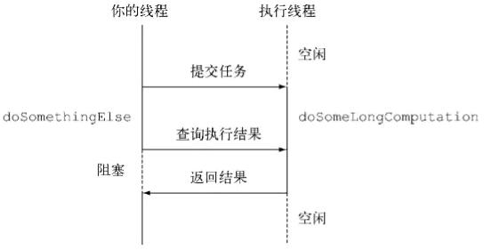

# JAVA8 新特性

[](##Lambda)

## Lambda

* 什么是`Lambda`

  Lambda 表达式（lambda expression）是一个匿名函数，Lambda表达式基于数学中的λ演算得名，直接对应于其中的lambda抽象（lambda abstraction），是一个**匿名函数**，即没有函数名的函数。Lambda表达式可以表示闭包。

* 什么是`闭包`

  闭包就是能够读取其他函数内部变量的函数。例如在javascript中，只有函数内部的子函数才能读取局部变量，所以闭包可以理解成**“定义在一个函数内部的函数“**。

Lambda 表达式主要用来定义行内执行的方法类型接口，例如，一个简单方法接口。在示例代码中，我们使用各种类型的Lambda表达式来定义MathOperation接口的方法。然后我们定义了sayMessage的执行。

Lambda 表达式免去了使用匿名方法的麻烦，并且给予Java简单但是强大的函数化的编程能力。

## StreamAPI

Java 8 API添加了一个新的抽象称为流Stream，可以让你以一种声明的方式处理数据。

Stream 使用一种类似用 SQL 语句从数据库查询数据的直观方式来提供一种对 Java 集合运算和表达的高阶抽象。

Stream API可以极大提高Java程序员的生产力，让程序员写出高效率、干净、简洁的代码。

这种风格将要处理的元素集合看作一种流， 流在管道中传输， 并且可以在管道的节点上进行处理， 比如筛选， 排序，聚合等。

元素流在管道中经过中间操作（intermediate operation）的处理，最后由最终操作(terminal operation)得到前面处理的结果。

```
+--------------------+       +------+   +------+   +---+   +-------+
| stream of elements +-----> |filter+-> |sorted+-> |map+-> |collect|
+--------------------+       +------+   +------+   +---+   +-------+
```

以上的流程转换为 Java 代码为：

```
List<Integer> transactionsIds = 
widgets.stream()
             .filter(b -> b.getColor() == RED)
             .sorted((x,y) -> x.getWeight() - y.getWeight())
             .mapToInt(Widget::getWeight)
             .sum();
```

### 什么是 Stream？

Stream（流）是一个来自数据源的元素队列并支持聚合操作

- 元素是特定类型的对象，形成一个队列。 Java中的Stream并不会存储元素，而是按需计算。
- **数据源** 流的来源。 可以是集合，数组，I/O channel， 产生器generator 等。
- **聚合操作** 类似SQL语句一样的操作， 比如filter, map, reduce, find, match, sorted等。

和以前的Collection操作不同， Stream操作还有两个基础的特征：

- **Pipelining**: 中间操作都会返回流对象本身。 这样多个操作可以串联成一个管道， 如同流式风格（fluent style）。 这样做可以对操作进行优化， 比如延迟执行(laziness)和短路( short-circuiting)。
- **内部迭代**： 以前对集合遍历都是通过Iterator或者For-Each的方式, 显式的在集合外部进行迭代， 这叫做外部迭代。 Stream提供了内部迭代的方式， 通过访问者模式(Visitor)实现。

### 常用Stream

* stream 生成流     

* forEach 应用于stream新的方法 'forEach' 来迭代流中的每个数据      

* map 用于映射每个元素到对应的结果（对流中的每个元素做操作后返回流       

* filter 用于通过设置的条件过滤出元素        

* limit 于获取指定数量的流       

* 并行（parallel）程序      

* Collectors 类实现了很多归约操作，例如将流转换成集合和聚合元素。

  - toList
  - toSet
  - toCollection

* 数值流

  `int sum = list.stream().map(Person::getAge).reduce(0, Integer::sum);` 计算元素总和的方法其中暗含了装箱成本，`map(Person::getAge)` 方法过后流变成了 Stream 类型，而每个 Integer 都要拆箱成一个原始类型再进行 sum 方法求和，这样大大影响了效率。

  针对这个问题 Java 8 有良心地引入了数值流 IntStream, DoubleStream, LongStream，这种流中的元素都是原始数据类型，分别是 int，double，long

  IntStream 与 LongStream 拥有 range 和 rangeClosed 方法用于数值范围处理

  - IntStream ： rangeClosed(int, int) / range(int, int)
  - LongStream ： rangeClosed(long, long) / range(long, long)

  这两个方法的区别在于一个是闭区间，一个是半开半闭区间：

  - rangeClosed(1, 100) ：[1, 100]
  - range(1, 100) ：[1, 100)

  数值流中的 max 方法返回的类型是Optional

  * NullPointerException 可以说是每一个 Java 程序员都非常讨厌看到的一个词，针对这个问题， Java 8 引入了一个新的容器类 Optional，可以代表一个值存在或不存在，这样就不用返回容易出问题的 null。之前文章的代码中就经常出现这个类，也是针对这个问题进行的改进。

  Optional 类比较常用的几个方法有：

  - isPresent() ：值存在时返回 true，反之 flase
  - get() ：返回当前值，若值不存在会抛出异常
  - orElse(T) ：值存在时返回该值，否则返回 T 的值

  Optional 类还有三个特化版本 OptionalInt，OptionalLong，OptionalDouble

  Optional 类其中其实还有很多学问，讲解它说不定也要开一篇文章，这里先讲那么多，先知道基本怎么用就可以。

## 并行流parallelStream

parallelStream提供了流的并行处理，它是Stream的另一重要特性，其底层使用Fork/Join框架实现。简单理解就是多线程异步任务的一种实现。

~~~java
List<Integer> numbers = Arrays.asList(1, 2, 3, 4, 5, 6, 7, 8, 9); 
numbers.parallelStream().forEach(num->System.out.println(num));

输出：3 4 2 6 7 9 8 1 5
~~~

使用parallelStream后，结果并不按照集合原有顺序输出。为了进一步证明该操作是并行的，我们打印出线程信息。

~~~java
   List<Integer> numbers = Arrays.asList(1, 2, 3, 4, 5, 6, 7, 8, 9); 
   numbers.parallelStream() .forEach(num-
   		>System.out.println(Thread.currentThread().getName()+">>"+num)); 
输出
main>>6 
ForkJoinPool.commonPool-worker-2>>8 
main>>5 ForkJoinPool.commonPool-worker-2>>9 
ForkJoinPool.commonPool-worker-1>>3 
ForkJoinPool.commonPool-worker-3>>2 
ForkJoinPool.commonPool-worker-1>>1 
ForkJoinPool.commonPool-worker-2>>7 
main>>4
~~~

可以确信parallelStream是利用多线程进行的，这可以很大程度简化我们使用并发操作。

* **并行流的陷阱**

  1. 线程安全

     由于并行流使用多线程，则一切线程安全问题都应该是需要考虑的问题，如：资源竞争、死锁、事务、可见性等等。

  2. 线程消费

     在虚拟机启动时，我们指定了worker线程的数量，整个程序的生命周期都将使用这些工作线程；这必然存在任务生产和消费的问题，如果某个生产者生产了许多重量级的任务（耗时很长），那么其他任务毫无疑问将会没有工作线程可用；更可怕的事情是这些工作线程正在进行IO阻塞。

     本应利用并行加速处理的业务，因为工作者不够反而会额外增加处理时间，使得系统性能在某一时刻大打折扣。而且这一类问题往往是很难排查的。我们并不知道一个重量级项目中的哪一个框架、哪一个模块在使用并行流。

  接下来我们对这个问题进行演示

**串行流**：适合存在线程安全问题、阻塞任务、重量级任务，以及需要使用同一事务的逻辑。

**并行流**：适合没有线程安全问题、较单纯的数据处理任务

## CompletableFuture组合式异步编程

**Future接口**

Future接口在Java 5中被引入，设计初衷是对将来某个时刻会发生的结果进行建模。它建模了一种异步计算，返回一个执行运算结果的引用，当运算结束后，这个引用被返回给调用方。在Future中触发那些潜在耗时的操作把调用线程解放出来，让它能继续执行其他有价值的工作，不需要等待耗时的操作完成。

~~~java
public static void main(String[] args) throws ExecutionException, InterruptedException {
        // 1 创建future
        FutureTask<String> stringFuture = new FutureTask<String>(new Callable<String>() {
            @Override
            public String call() throws Exception {
                Thread.sleep(1000);

                return "Future--Test";
            }
        });
        // 线程执行
        ExecutorService executor = Executors.newCachedThreadPool();
        executor.execute(stringFuture);

        //2 //向ExecutorService提交一个Callable对象
        Future<String> future = executor.submit(new Callable<String>() {
            @Override
            public String call() throws InterruptedException {
                Thread.sleep(1000);
                //以异步方式在新线程中执行耗时的操作
                return "延时1秒";
            }
        });
        // 注意get会 阻塞
        System.out.println(stringFuture.get());

        System.out.println(future.get());
        executor.shutdown();

    }
~~~

这种编程方式让你的线程可以在ExecutorService以并发方式调用另一个线程执行耗时操作的同时，去执行一些其他任务。如果已经运行到没有异步操作的结果就无法继续进行时，可以调用它的get方法去获取操作结果。如果操作已经完成，该方法会立刻返回操作结果，否则它会阻塞线程，直到操作完成，返回相应的结果。
为了处理长时间运行的操作永远不返回的可能性，虽然Future提供了一个无需任何参数的get方法，但还是推荐使用重载版本的get方法，它接受一个超时的参数，可以定义线程等待Future结果的时间，而不是永无止境地等待下去



**Future接口的局限性**
Future接口提供了方法来检测异步计算是否已经结束（使用isDone方法），等待异步操作结束，以及获取计算的结果。但这些特性还不足以让你编写简洁的并发代码。

- 将两个异步计算合并为一个，这两个异步计算之间相互独立，同时第二个又依赖于第一个的结果。
- 等待Future集合中的所有任务都完成。
- 仅等待Future集合中快结束的任务完成，并返回它的结果。
- 通过编程方式完成一个Future任务的执行。
- 应对Future的完成事件（即当Future的完成事件发生时会收到通知，并能使用Future计算的结果进行下一步操作，不只是简单地阻塞等待操作结果）。

**实现异步API**

