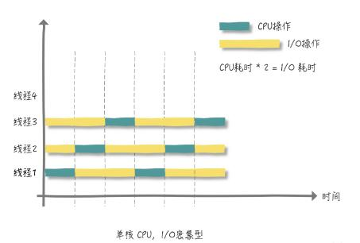
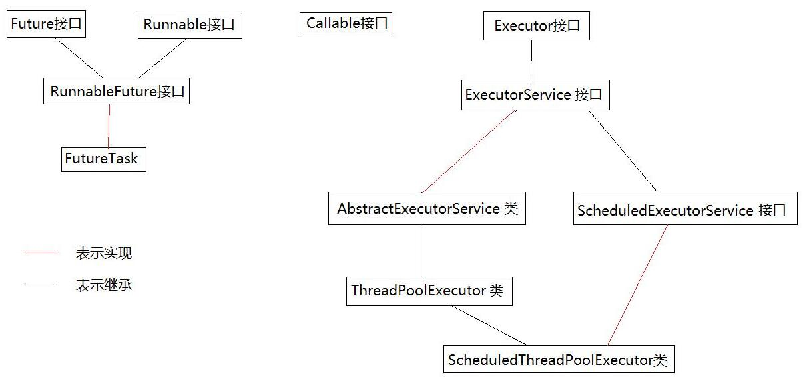
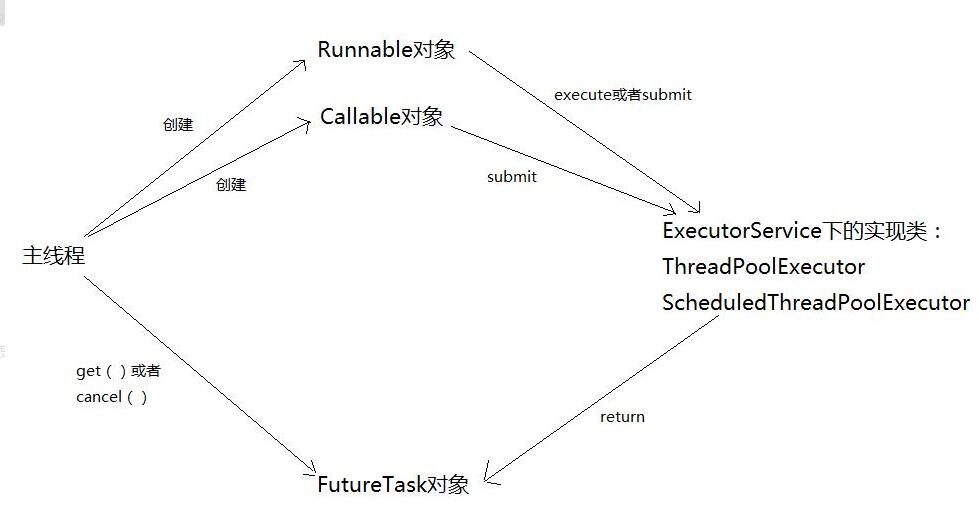
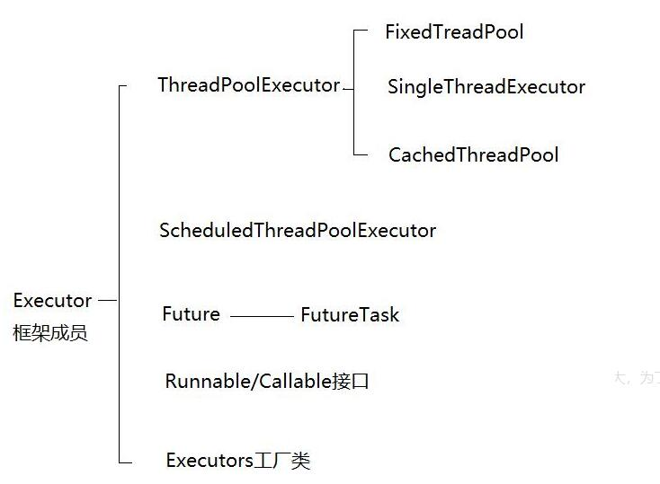
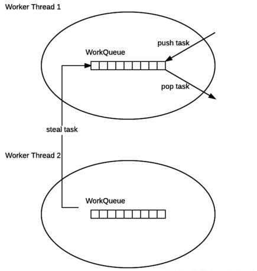

# Java 多线程

## 进程与线程

* **进程**

  进程是操作系统结构的基础；是一次程序的执行；是一个程序及其数据在处理机上顺序执行时所发生的活动。操作系统中，几乎所有运行中的任务对应一条进程（Process）。一个程序进入内存运行，即变成一个进程。进程是处于运行过程中的程序，并且具有一定独立功能。描述进程的有一句话非常经典的话——**进程是系统进行资源分配和调度的一个独立单位。**

  进程是系统中独立存在的实体，拥有自己独立的资源，拥有自己私有的地址空间**。**进程的实质，就是程序在多道程序统中的一次执行过程，它是动态产生，动态消亡的，具有自己的生命周期和各种不同的状态。进程具有并发性，它可以同其他进程一起并发执行，按各自独立的、不可预知的速度向前推进。　

  （注意，并发性（concurrency）和并行性（parallel）是不同的。**并行指的是同一时刻，多个指令在多台处理器上同时运行。并发指的是同一时刻只能有一条指令执行，但多个进程指令被快速轮换执行，看起来就好像多个指令同时执行一样。**）

  进程由**程序**、**数据**和**进程控制块**三部分组成。

* **线程**

  线程，有时被称为轻量级进程(Lightweight Process，LWP），是程序执行流的最小单元。一个标准的线程由线程ID，当前指令指针(PC），寄存器集合和堆栈组成。另外，线程是进程中的一个实体，是被系统独立调度和分派的基本单位，**线程自己不拥有系统资源，只拥有一点儿在运行中必不可少的资源，但它可与同属一个进程的其它线程共享进程所拥有的全部资源**。一个线程可以创建和撤消另一个线程，同一进程中的多个线程之间可以并发执行。由于线程之间的相互制约，致使线程在运行中呈现出间断性。每一个程序都至少有一个线程，若程序只有一个线程，那就是程序本身。

  **线程是程序中一个单一的顺序控制流程。在单个程序中同时运行多个线程完成不同的工作，称为多线程。**

  在Java Web中要注意，线程是JVM级别的，在不停止的情况下，跟JVM共同消亡，就是说如果一个Web服务启动了多个Web应用，某个Web应用启动了某个线程，如果关闭这个Web应用，线程并不会关闭，因为JVM还在运行，所以别忘了设置Web应用关闭时停止线程。

## 使用多线程场景

- **CPU 密集型程序**

  > 一个完整请求，I/O操作可以在很短时间内完成， CPU还有很多运算要处理，也就是说 CPU 计算的比例占很大一部分

  假如我们要计算 1+2+....100亿 的总和，很明显，这就是一个 CPU 密集型程序

  在【单核】CPU下，如果我们创建 4 个线程来分段计算，即：

  1. 线程1计算 `[1,25亿）`
  2. ...... 以此类推
  3. 线程4计算 `[75亿，100亿]`

  我们来看下图他们会发生什么？

  

  由于是单核 CPU，所有线程都在等待 CPU 时间片。按照理想情况来看，四个线程执行的时间总和与一个线程5独自完成是相等的，实际上我们还忽略了四个线程上下文切换的开销

  **所以，单核CPU处理CPU密集型程序，这种情况并不太适合使用多线程**

  此时如果在 4 核CPU下，同样创建四个线程来分段计算，看看会发生什么？

  

  每个线程都有 CPU 来运行，并不会发生等待 CPU 时间片的情况，也没有线程切换的开销。理论情况来看效率提升了 4 倍

  **所以，如果是多核CPU 处理 CPU 密集型程序，我们完全可以最大化的利用 CPU 核心数，应用并发编程来提高效率**

  对于 CPU 密集型来说，理论上 `线程数量 = CPU 核数（逻辑）` 就可以了，但是实际上，数量一般会设置为 `CPU 核数（逻辑）+ 1`， 为什么呢？

  《Java并发编程实战》这么说：

  > 计算(CPU)密集型的线程恰好在某时因为发生一个页错误或者因其他原因而暂停，刚好有一个“额外”的线程，可以确保在这种情况下CPU周期不会中断工作

  所以对于CPU密集型程序，  `CPU 核数（逻辑）+ 1` 个线程数是比较好

- **I/O 密集型程序**

  > 与 CPU 密集型程序相对，一个完整请求，CPU运算操作完成之后还有很多 I/O 操作要做，也就是说 I/O 操作占比很大部分

  我们都知道在进行 I/O 操作时，CPU是空闲状态，所以我们要最大化的利用 CPU，不能让其是空闲状态

  同样在单核 CPU 的情况下：

  

  从上图中可以看出，每个线程都执行了相同长度的 CPU 耗时和 I/O 耗时，如果你将上面的图多画几个周期，CPU操作耗时固定，将 I/O 操作耗时变为 CPU 耗时的 3 倍，你会发现，CPU又有空闲了，这时你就可以新建线程 4，来继续最大化的利用 CPU。

  综上两种情况我们可以做出这样的总结：

  > 线程等待时间所占比例越高，需要越多线程；线程CPU时间所占比例越高，需要越少线程。

  上面已经让大家按照图多画几个周期（你可以动手将I/O耗时与CPU耗时比例调大，比如6倍或7倍），这样你就会得到一个结论，对于 I/O 密集型程序：

  > 最佳线程数 =  `(1/CPU利用率)` = `1 + (I/O耗时/CPU耗时)`

## 线程的生命周期及五种基本状态

Java中线程的生命周期


上图中基本上囊括了Java中多线程各重要知识点。掌握了上图中的各知识点，Java中的多线程也就基本上掌握了。

**Java线程具有五种基本状态**

**新建状态（New）：**当线程对象对创建后，即进入了新建状态，如：Thread t = new MyThread()。

**就绪状态（Runnable）：**当调用线程对象的start()方法（t.start();），线程即进入就绪状态。处于就绪状态的线程，只是说明此线程已经做好了准备，随时等待CPU调度执行，并不是说执行了t.start()此线程立即就会执行。

**运行状态（Running）：**当CPU开始调度处于就绪状态的线程时，此时线程才得以真正执行，即进入到运行状态。注：就绪状态是进入到运行状态的唯一入口，也就是说，线程要想进入运行状态执行，首先必须处于就绪状态中。

**阻塞状态（Blocked）：**处于运行状态中的线程由于某种原因，暂时放弃对CPU的使用权，停止执行，此时进入阻塞状态，直到其进入到就绪状态，才有机会再次被CPU调用以进入到运行状态。根据阻塞产生的原因不同，阻塞状态又可以分为三种：

*1.等待阻塞 -- 运行状态中的线程执行wait()方法，使本线程进入到等待阻塞状态；*

*2.同步阻塞 -- 线程在获取synchronized同步锁失败(因为锁被其它线程所占用)，它会进入同步阻塞状态；*

*3.其他阻塞 -- 通过调用线程的sleep()或join()或发出了I/O请求时，线程会进入到阻塞状态。当sleep()状态超时、join()等待线程终止或者超时、或者I/O处理完毕时，线程重新转入就绪状态。*

**死亡状态（Dead）：**线程执行完了或者因异常退出了run()方法，该线程结束生命周期。

## 创建多线程的方式

* 继承Thread类，重写该类的run()方法

  thread  run()  start() 是干什么的？为什么一调他们就开始运行里面的方法了？以及区别？

  这个属于线程的同步机制问题，也就是线程安全问题，实际开发中用到多线程的例子很多，比如说：银行排号、火车站买票等，就是很多机器同时访问共享数据的时候就是这个了。

  线程启动之后（被调之后），会运行被覆盖的run方法。

  先说用thread.run()来启动线程，会顺序执行，run启动一条线程之后将这条线程走完之后，才执行下面的run，想想火车站排票？要是用run就等于一条长蛇队了。

  再说用thread.start来启动线程，这个才是真正实现了多线程运行，thread.start()不用等待被覆盖的run执行完也可以直接继续执行下面的代码，线程处于就绪状态，交替执行直到结束。

* 实现java.lang.Runnable接口

* 使用Callable和Future接口创建线程

  注意：继承Thread类和实现Runable接口实现线程，线程的调度有所区别

  * 继承Thread类的：在线程调度使用的时候

    ~~~java
    //实现
    public class ThreadDemo2 extends Thread {
        private String name;
        public ThreadDemo2(String name) {
            this.name = name;
        }
        @Override
        public void run() {
            System.out.println(Thread.currentThread().getName() + "Thread 开始运行");
            for (int i = 0; i < 5; i++) {
                System.out.println("子线程" + name + "运行：" + i);
                try {
                    sleep((int) Math.random() * 10);
                } catch (Exception e) {
                    e.printStackTrace();
                }
            }
            System.out.println(Thread.currentThread().getName() + "Thread 运行结束");
        }
    }
    
    // 使用
    ThreadDemo2 threadAt = new ThreadDemo2("At");
    threadAt.start();
    ~~~

  * 实现Runable接口

    ~~~java
    // 实现
    public class ThreadDemo1 implements Runnable {
        private String name;
        public ThreadDemo1(String name) {
            this.name = name;
        }
        @Override
        public void run() {
            System.out.println(Thread.currentThread().getName() + "Runnable 开始运行");
            for (int i = 0; i < 5; i++) {
                System.out.println("子线程" + name + "运行：" + i);
                try {
                    sleep((int) Math.random() * 10);
                } catch (Exception e) {
                    e.printStackTrace();
                }
            }
            System.out.println(Thread.currentThread().getName() + "Runnable 运行结束");
        }
    }
    
    // 使用
    ThreadDemo1 threadA = new ThreadDemo1("Aa");
    Thread threadAa = new Thread(threadA);
    threadAa.start();
    ~~~

  * 注意实现调度使用的时候，使用的start是start还是run。

## 线程调度

* **线程加入——`join()`**

  `join` —— 让一个线程等待另一个线程完成才继续执行。如A线程执行体中调用B线程的`join()`方法，则A线程被阻塞，直到B线程执行完为止，A才能得以继续执行。

  join()方法，等待其他线程终止。*在当前线程中调用另一个线程的join()方法，则当前线程转入阻塞状态，直到另一个线程运行结束，当前线程再由阻塞转为就绪状态。*

  join是Thread类的一个方法，启动线程后直接调用，*join() 的作用：让“主线程”等待“子线程”结束之后才能继续运行。*

  **为什么要用join() 方法？**

  ​     在很多情况下，主线程生成并起动了子线程，如果子线程里要进行大量的耗时的运算，主线程往往将于子线程之前结束，但是如果主线程处理完其他的事务后，需要用到子线程的处理结果，也就是主线程需要等待子线程执行完成之后再结束，这个时候就要用到join()方法了。

* **线程休眠——sleep()**

  sleep() 的作用是让**当前线程休眠**，即当前线程会从“运行状态”进入到“休眠(阻塞)状态”。sleep()会指定休眠时间，线程休眠的时间会大于/等于该休眠时间；在线程重新被唤醒时，它会由“阻塞状态”变成“就绪状态”，从而等待cpu的调度执行。常用来暂停程序的运行。同时注意，**sleep()方法不会释放锁**。

  sleep仅会影响当前线程

* **线程让步——yield()**

  ​     yield()是Thread类的静态方法。**它能让当前线程暂停，但不会阻塞该线程，而是由“运行状态”进入到“就绪状态”**，从而让其它具有相同优先级的等待线程获取执行。因此，使用yield()的目的是让相同优先级的线程之间能适当的轮转执行。但是，并不能保证在当前线程调用yield()之后，其它具有相同优先级的线程就一定能获得执行权，也有可能是当前线程又进入到“运行状态”继续运行！值得注意的是，**yield()方法不会释放锁**。

* **线程中断——interrupt()**

  我们经常通过判断线程的中断标记来控制线程。　 　

  　 interrupt()是Thread类的一个实例方法，用于中断本线程。这个方法被调用时，会立即将线程的中断标志设置为“true”。所以当中断处于“阻塞状态”的线程时，由于处于阻塞状态，中断标记会被设置为“false”，抛出一个 InterruptedException。所以我们在线程的循环外捕获这个异常，就可以退出线程了。

  　 interrupt()并不会中断处于“运行状态”的线程，它会把线程的“中断标记”设置为true，所以我们可以不断通过isInterrupted()来检测中断标记，从而在调用了interrupt()后终止线程，这也是通常我们对interrupt()的用法。

  　 interrupted()是Thread类的一个静态方法，它返回一个布尔类型指明当前线程是否已经被中断，isInterrupted()是Thread类的实例方法，返回一个布尔类型来判断线程是否已经被中断。它们都能够用于检测对象的“中断标记”。区别是，interrupted()除了返回中断标记之外，它还会清除中断标记(即将中断标记设为false)；而isInterrupted()仅仅返回中断标记。

## 线程安全与线程同步

* **线程不安全**

  ~~~java
  public class DrawMoneyRunnable implements Runnable{
      private Account account;
      private double drawAmount;
      public DrawMoneyRunnable(Account account, double drawAmount) {
          super();
          this.account = account;
          this.drawAmount = drawAmount;
      }
      public void run() {
          if (account.getBalance() >= drawAmount) {  //1
              System.out.println("取钱成功， 取出钱数为：" + drawAmount);
              double balance = account.getBalance() - drawAmount;
              account.setBalance(balance);
              System.out.println("余额为：" + balance);
          }
      }
  }
  
  public class ThreadTest {
      public static void main(String[] args) {
          Account account = new Account("123456", 1000);
          DrawMoneyRunnable drawMoneyRunnable = new DrawMoneyRunnable(account, 700);
          Thread myThread1 = new Thread(drawMoneyRunnable);
          Thread myThread2 = new Thread(drawMoneyRunnable);
          myThread1.start();
          myThread2.start();
      }
  
  }
  
  取钱成功， 取出钱数为：700.0
  余额为：300.0
  取钱成功， 取出钱数为：700.0
  余额为：-400.0
  ~~~

  对于一张只有1000余额的银行卡，你们一共可以取出1400，这显然是有问题的。

  ​     经过分析，问题在于Java多线程环境下的执行的不确定性。CPU可能随机的在多个处于就绪状态中的线程中进行切换，因此，很有可能出现如下情况：当thread1执行到//1处代码时，判断条件为true，此时CPU切换到thread2，执行//1处代码，发现依然为真，然后执行完thread2，接着切换到thread1，接着执行完毕。此时，就会出现上述结果。

  ​     因此，讲到线程安全问题，其实是指多线程环境下对共享资源的访问可能会引起此共享资源的不一致性。因此，为避免线程安全问题，应该避免多线程环境下对此共享资源的并发访问。

* 多线程同步

  **为何要使用同步？** 

  ​     java允许多线程并发控制，当多个线程同时操作一个可共享的资源变量时（如数据的增删改查），将会导致数据不准确，相互之间产生冲突，因此加入同步锁以避免在该线程没有完成操作之前，被其他线程的调用，从而保证了该变量的唯一性和准确性。

  * **同步方法**

  ​     对共享资源进行访问的方法定义中加上synchronized关键字修饰，使得此方法称为同步方法。可以简单理解成对此方法进行了加锁，其锁对象为当前方法所在的对象自身。多线程环境下，当执行此方法时，首先都要获得此同步锁（且同时最多只有一个线程能够获得），只有当线程执行完此同步方法后，才会释放锁对象，其他的线程才有可能获取此同步锁，以此类推...。

  ​     在上例中，共享资源为account对象，当使用同步方法时，可以解决线程安全问题。只需在run()方法前加上synchronized关键字即可。

  ~~~java
  public synchronized void run() {
          if (account.getBalance() >= drawAmount) {
              System.out.println("取钱成功，取出：" + drawAmount);
              double balance = account.getBalance() - drawAmount;
              account.setBalance(balance);
              System.out.println("余额为：" + balance);
          }
      }
  ~~~

  * **同步代码块**

  ​     正如上面所分析的那样，解决线程安全问题其实只需限制对共享资源访问的不确定性即可。使用同步方法时，使得整个方法体都成为了同步执行状态，会使得可能出现同步范围过大的情况，于是，针对需要同步的代码可以直接另一种同步方式——同步代码块来解决。

  同步代码块的格式为：

  ```java
  /**
  synchronized (obj) {           
      //...
  }
  */
  @Override
      public void run() {
          synchronized (account){
              if (account.getBalance() >= drawAmount) {
                  System.out.println("取钱成功，取出：" + drawAmount);
                  double balance = account.getBalance() - drawAmount;
                  account.setBalance(balance);
                  System.out.println("余额为：" + balance);
              }
          }
  
      }
  ```

  ​      其中，obj为锁对象，因此，选择哪一个对象作为锁是至关重要的。一般情况下，都是选择此共享资源对象作为锁对象。

  ​      如上例中，最好选用account对象作为锁对象。（当然，选用this也是可以的，那是因为创建线程使用了runnable方式，如果是直接继承Thread方式创建的线程，使用this对象作为同步锁其实没有起到任何作用，因为是不同的对象了。因此，选择同步锁时需要格外小心...）

* `synchronized`关键字

  * 原理

    在java中，每一个对象有且仅有一个同步锁。这也意味着，同步锁是依赖于对象而存在。**当前线程调用某对象的synchronized方法时，就获取了该对象的同步锁。例如，synchronized(obj)，当前线程就获取了“obj这个对象”的同步锁。**

    **不同线程对同步锁的访问是互斥的。**也就是说，某时间点，对象的同步锁只能被一个线程获取到！通过同步锁，我们就能在多线程中，实现对“对象/方法”的互斥访问。 例如，现在有个线程A和线程B，它们都会访问“对象obj的同步锁”。假设，在某一时刻，线程A获取到“obj的同步锁”并在执行一些操作；而此时，线程B也企图获取“obj的同步锁” —— 线程B会获取失败，它必须等待，直到线程A释放了“该对象的同步锁”之后线程B才能获取到“obj的同步锁”从而才可以运行。

  * 基本规则

    第一条：当一个线程访问“某对象”的“synchronized方法”或者“synchronized代码块”时，其他线程对**“该对象”的该“synchronized方法”或者“synchronized代码块”的访问**将被阻塞。

    第二条：当一个线程访问“某对象”的“synchronized方法”或者“synchronized代码块”时，其他线程仍然**可以访问“该对象”的非同步代码块**。

    第三条：当一个线程访问“某对象”的“synchronized方法”或者“synchronized代码块”时，其他线程对**“该对象”的其他的“synchronized方法”或者“synchronized代码块”的访问**将被阻塞。

  * 实例锁和全局锁

    **实例锁** -- 锁在某一个实例对象上。如果该类是单例，那么该锁也具有全局锁的概念。实例锁对应的就是synchronized关键字。

    **全局锁** -- 该锁针对的是类，无论实例多少个对象，那么线程都共享该锁。全局锁对应的就是static synchronized（或者是锁在该类的class或者classloader对象上）。

    就是说，一个非静态方法上的synchronized关键字，代表该方法依赖其所属对象。一个静态方法上synchronized关键字，代表该方法依赖这个类本身。

## 线程通信

* wait()：导致当前线程等待并使其进入到等待阻塞状态。直到其他线程调用该同步锁对象的notify()或notifyAll()方法来唤醒此线程。

* notify()：唤醒在此同步锁对象上等待的单个线程，如果有多个线程都在此同步锁对象上等待，则会任意选择其中某个线程进行唤醒操作，只有当前线程放弃对同步锁对象的锁定，才可能执行被唤醒的线程。

* notifyAll()：唤醒在此同步锁对象上等待的所有线程，**只有当前线程放弃对同步锁对象的锁定，才可能执行被唤醒的线程。**

  ~~~java
  // 存取钱的demo
  ~~~

  注意：

  * wait()方法执行后，当前线程立即进入到等待阻塞状态，其后面的代码不会执行；

  * notify()/notifyAll()方法执行后，将唤醒此同步锁对象上的（任意一个-notify()/所有-notifyAll()）线程对象，但是，此时还并没有释放同步锁对象，也就是说，*如果notify()/notifyAll()后面还有代码，还会继续执行，直到当前线程执行完毕才会释放同步锁对象，或者执行了wait（）方法*

  * notify()/notifyAll()执行后，如果下面有sleep()方法，则会使当前线程进入到阻塞状态，但是同步对象锁没有释放，依然自己保留，那么一定时候后还是会继续执行此线程，接下来同2；

  * wait()/notify()/nitifyAll()完成线程间的通信或协作都是基于相同对象锁的，因此，如果是不同的同步对象锁将失去意义，同时，同步对象锁最好是与共享资源对象保持一一对应关系；

  * 当wait线程唤醒后并执行时，是接着上次执行到的wait()方法代码后面继续往下执行的。

## 线程优先级和守护线程

* thread.setDaemon(true)必须在thread.start()之前设置，否则会抛出一个IllegalThreadStateException异常。你不能把正在运行的常规线程设置为守护线程。 

* 在Daemon线程中产生的新线程也是Daemon的。

* 守护线程应该永远不去访问固有资源，如文件、数据库，因为它会在任何时候甚至在一个操作的中间发生中断。

## Executor框架

我们知道线程池就是线程的集合，线程池集中管理线程，以实现线程的重用，降低资源消耗，提高响应速度等。线程用于执行异步任务，单个的线程既是工作单元也是执行机制，从JDK1.5开始，为了把工作单元与执行机制分离开，Executor框架诞生了，他是一个用于统一创建与运行的接口。Executor框架实现的就是线程池的功能。

> 接口提供了一种优雅的方式去`解耦`任务处理机制中的`任务提交`和`任务如何运行`（也包含线程的使用，调度）

重点是解耦，解耦，解耦

大家比较一下两者有什么差别？很明显的可以看出来非显示创建线程的方式更优雅，我只要关心一点就是`我`把`任务交给了执行人（器）`，剩下的事情就是执行人（器）考虑的问题了，至于执行人会把我的任务`安排一个人做`还是交给`多个人做`，那是他的事情，具体的活怎么干我不关心，总结下来就是`我们不用关心执行器内部是如何运行任务的细节`

**Executor框架包括3大部分：**

- 任务。也就是工作单元，包括被执行任务需要实现的接口：*Runnable接口或者Callable接口*；

- 任务的执行。也就是把任务分派给多个线程的执行机制，包括*Executor接口*及继承自Executor接口的*ExecutorService接口*。

- 异步计算的结果。包括*Future接口*及实现了Future接口的*FutureTask类*。

**Executor框架的成员及其关系可以用一下的关系图：**



**使用示意图：**



**Executor框架成员**



* Runnable和Callable接口：用于实现线程要执行的工作单元。

* Executors工厂类：提供了常见配置线程池的方法，因为ThreadPoolExecutor的参数众多且意义重大，为了避免配置出错，才有了Executors工厂类。

* Future接口/FutureTask实现类

  一直以来都对FutureTask这个“Future”不理解，为什么叫做“未来的任务呢”？这个“Future”体现在哪里呢？现在终于明白，FutureTask的Future就源自于它的异步工作机制，如果我们在主线程中直接写一个函数来执行任务，这是同步的任务，也就是说必须要等这个函数返回以后我们才能继续做接下的事情，但是如果这个函数返回的结果对接下来的任务并没有意义，那么我们等在这里是很浪费时间的，而FutureTask就提供了这么一个异步的返回结果的机制，当执行一个FutureTask的时候，我们可以接着做别的任务，在将来的某个时间，FutureTask任务完成后会返回FutureTask对象来包装返回的结果，只要调用这个对象的get（）方法即可获取返回值。

  当然多线程中继承ThreadPoolExecutor和实现Runnable也可以实现异步工作机制，可是他们没有返回值。这时可以使用FutureTask包装Runnable或者Callable对象，再使用FutureTask来执行任务。

  Future接口和其唯一的实现类FutureTask类一般用于表示异步计算的结果。Future接口下提供方法来检查计算是否完成，等待其完成，并检索计算结果。 结果只能在计算完成后使用方法get进行检索，如有必要，阻塞，直到准备就绪。 取消由cancel方法执行，isCancelled方法用于检测计算是否被取消，isDone方法用于检测计算是否完成。 提供其他方法来确定任务是否正常完成或被取消。

* ThreadPoolExecutor实现类、cheduledThreadPoolExecutor实现类下面详细介绍


## 线程池

**线程池介绍**

线程池的概念是初始化线程池时在池中创建空闲的线程，一但有工作任务，可直接使用线程池中的线程进行执行工作任务，任务执行完成后又返回线程池中成为空闲线程。使用线程池可以减少线程的创建和销毁，提高性能。

举个例子：我是一个包工头，代表线程池，手底下有若干工人代表线程池中的线程。如果我没接到项目，那么工人就相当于线程池中的空闲线程，一但我接到了项目，我可以立刻让我手下的工人去工作，每个工人同一时间执行只执行一个工作任务，执行完了就去

执行另一个工作任务，知道没有工作任务了，这时工人就可以休息了（原谅我让工人无休止的工作），也就是又变成了线程池中的空闲线程池。

**队列是什么**

队列作为一个缓冲的工具，当没有足够的线程去处理任务时，可以将任务放进队列中，以队列先进先出的特性来执行工作任务

举个例子，我又是一个包工头，一开始我只接了一个小项目，所以只有三个工作任务，但我手底下有四个工人，那么其中三人各领一个工作任务去执行就好了，剩下一个人就先休息。但突然我又接到了几个大项目，那么有现在有很多工作任务了，但手底下的工人不够啊。

那么我有两个选择：

* 雇佣更多的工人

* 把工作任务记录下来，按先来后到的顺序执行

但雇佣更多等工人需要成本啊，对应到计算机就是资源的不足，所以我只能把工作任务先记录下来，这样就成了一个队列了。

**为什么要使用线程池**

假设我又是一个包工头，我现在手底下没有工人了，但我接到了一个项目，有了工作任务要执行，那我肯定要去找工人了，但招人成本是很高的，工作完成后还要给遣散费，这样算起来好像不值，所以我事先雇佣了固定的几个工人作为我的长期员工，有工作任务就干活，没有就休息，如果工作任务实在太

多，那我也可以再临时雇佣几个工人。一来二去工作效率高了，付出的成本也低了。Java自带的线程池的原理也是如此。

在web开发中，服务器需要接受并处理请求，所以会为一个请求来分配一个线程来进行处理。如果每次请求都新创建一个线程的话实现起来非常简便，但是存在一个问题：

**如果并发的请求数量非常多，但每个线程执行的时间很短，这样就会频繁的创建和销毁线程，如此一来会大大降低系统的效率。可能出现服务器在为每个请求创建新线程和销毁线程上花费的时间和消耗的系统资源要比处理实际的用户请求的时间和资源更多。**

那么有没有一种办法使执行完一个任务，并不被销毁，而是可以继续执行其他的任务呢？

这就是线程池的目的了。线程池为线程生命周期的开销和资源不足问题提供了解决方案。通过对多个任务重用线程，线程创建的开销被分摊到了多个任务上。

**什么时候使用线程池？**

- 单个任务处理时间比较短
- 需要处理的任务数量很大

**使用线程池的好处**

- 降低资源消耗。通过重复利用已创建的线程降低线程创建和销毁造成的消耗。
- 提高响应速度。当任务到达时，任务可以不需要的等到线程创建就能立即执行。
- 提高线程的可管理性。线程是稀缺资源，如果无限制的创建，不仅会消耗系统资源，还会降低系统的稳定性，使用线程池可以进行统一的分配，调优和监控。

在`《阿里巴巴java开发手册》`中指出了线程资源必须通过线程池提供，不允许在应用中自行显示的创建线程，这样一方面是线程的创建更加规范，可以合理控制开辟线程的数量；另一方面线程的细节管理交给线程池处理，优化了资源的开销。而线程池不允许使用`Executors`去创建，而要通过`ThreadPoolExecutor`方式，这一方面是由于`jdk`中`Executor`框架虽然提供了如`newFixedThreadPool()`、`newSingleThreadExecutor()`、`newCachedThreadPool()`等创建线程池的方法，但都有其局限性，不够灵活；另外由于前面几种方法内部也是通过`ThreadPoolExecutor`方式实现，使用`ThreadPoolExecutor`有助于大家明确线程池的运行规则，创建符合自己的业务场景需要的线程池，避免资源耗尽的风险。

* `ThreadPoolExecutor`

  线程池执行器，被用来解决两个不同的问题：
> 1：`执行大量异步任务`的`性能提升`
  > 2：提供了一种`限制和管理资源`的方式，比如`线程`，同时，也包含一些`基础统计`，如`已执行完成的任务数`等

  构造方法解析：

  ~~~java
  public ThreadPoolExecutor(int corePoolSize,
                                int maximumPoolSize,
                                long keepAliveTime,
                                TimeUnit unit,
                                BlockingQueue<Runnable> workQueue,
                                ThreadFactory threadFactory,
                                RejectedExecutionHandler handler) {
          if (corePoolSize < 0 ||
              maximumPoolSize <= 0 ||
              maximumPoolSize < corePoolSize ||
              keepAliveTime < 0)
              throw new IllegalArgumentException();
          if (workQueue == null || threadFactory == null || handler == null)
              throw new NullPointerException();
          this.acc = System.getSecurityManager() == null ?
                  null :
                  AccessController.getContext();
          this.corePoolSize = corePoolSize;
          this.maximumPoolSize = maximumPoolSize;
          this.workQueue = workQueue;
          this.keepAliveTime = unit.toNanos(keepAliveTime);
        this.threadFactory = threadFactory;
          this.handler = handler;
    }
  ~~~

  参数解析：

  ~~~properties
corePoolSize:指定了线程池中的线程数量，它的数量决定了添加的任务是开辟新的线程去执行，还是放到workQueue任务队列中去；
  
maximumPoolSize:指定了线程池中的最大线程数量，这个参数会根据你使用的workQueue任务队列的类型，决定线程池会开辟的最大线程数量；
  
keepAliveTime:当线程池中空闲线程数量超过corePoolSize时，多余的线程会在多长时间内被销毁；
  
unit:keepAliveTime的单位
  
workQueue:任务队列，被添加到线程池中，但尚未被执行的任务；它一般分为直接提交队列、有界任务队列、无界任务队列、优先任务队列几种；
  
threadFactory:线程工厂，用于创建线程，一般用默认即可；
  
handler:拒绝策略；当任务太多来不及处理时，如何拒绝任务；
  ~~~

  要能够被广泛使用，该类提供了很多可调参数以及可扩展的钩子，然而程序员被要求使用更为便利的执行器工厂`Executors`的方法们，如：

  - `newCachedThreadPool(...)` 不限制的线程池执行器

    newCachedThreadPool将创建一个可缓存的线程池。如果线程池的当前规模超过了处理需求时，那么就会回收部分空闲的线程（根据空闲时间来回收），当需求增加时，此线程池又可以智能的添加新线程来处理任务。此线程池不会对线程池大小做限制，线程池大小完全依赖于操作系统（或者说JVM）能够创建的最大线程大小。
  
  - `newFixedThreadPool(...)` 固定线程数量的线程池执行器
  
    newFixedThreadPool将创建一个固定长度的线程池，每当提交一个任务时就会创建一个线程，直到达线程池的最大数量，这时线程池的规模不再变化（如果某个线程由于发生了未预期的Exception而结束，那么线程池会补充一个新的线程）。上述代码中最大的线程数是3，但我提交了4个任务，而且每个任务都阻塞住，所以前三个任务占用了线程池所有的线程，那么第四个任务永远也不会执行，因此该线程池配套使用的队列也是无界的。所以在使用该方法创建线程池时要根据实际情况看需要执行的任务是否占用过多时间，会不会影响后面任务的执行。
  
  - `newSingleThreadExecutor(...)` 单线程数量的线程池执行器
  
    newSingleThreadExecutor是一个单线程的Executor，它创建单个工作者线程来执行任务，如果这个线程异常结束，会创建另一个线程来代替。newSingleThreadExecutor能确保依照任务在队列中的顺序来串行执行。
  
  - `newScheduledThreadPool(...)`
  
    newScheduledThreadPool创建了一个固定长度的线程池，而且以延迟或定时或周期的方式来执行任务，类似于Timer。可应用于重发机制。

  以上工厂方法为大部分场景做了预配置，实际上内部都是调用了`newThreadPoolExecutor(...)`的构造函数，我们在使用的时候直接使用即可，另外如果需要手动配置和调优ThreadPoolExecutor，可以参考以下指导：

  * **workQueue任务队列**
  
    * **直接提交队列**
    
      ~~~java
      pool = new ThreadPoolExecutor(1, 2, 1000, TimeUnit.MILLISECONDS, new SynchronousQueue<Runnable>(), Executors.defaultThreadFactory(), new ThreadPoolExecutor.AbortPolicy());
      ~~~
    
      设置为`SynchronousQueue队列`，SynchronousQueue是一个特殊的BlockingQueue，它没有容量，每执行一个插入操作就会阻塞，需要再执行一个删除操作才会被唤醒，反之每一个删除操作也都要等待对应的插入操作。
    
      使用SynchronousQueue队列，提交的任务不会被保存，总是会马上提交执行。如果用于执行任务的线程数量小于maximumPoolSize，则尝试创建新的进程，如果达到maximumPoolSize设置的最大值，则根据你设置的handler执行拒绝策略。因此这种方式你提交的任务不会被缓存起来，而是会被马上执行，在这种情况下，你需要对你程序的并发量有个准确的评估，才能设置合适的maximumPoolSize数量，否则很容易就会执行拒绝策略；  
    
    * **有界的任务队列**
    
      ~~~java
      pool = new ThreadPoolExecutor(1, 2, 1000, TimeUnit.MILLISECONDS, new ArrayBlockingQueue<Runnable>(10),Executors.defaultThreadFactory(),new ThreadPoolExecutor.AbortPolicy());
      ~~~
      
      使用`ArrayBlockingQueue有界任务队列`，若有新的任务需要执行时，线程池会创建新的线程，直到创建的线程数量达到corePoolSize时，则会将新的任务加入到等待队列中。若等待队列已满，即超过ArrayBlockingQueue初始化的容量，则继续创建线程，直到线程数量达到maximumPoolSize设置的最大线程数量，若大于maximumPoolSize，则执行拒绝策略。在这种情况下，线程数量的上限与有界任务队列的状态有直接关系，如果有界队列初始容量较大或者没有达到超负荷的状态，线程数将一直维持在corePoolSize以下，反之当任务队列已满时，则会以maximumPoolSize为最大线程数上限。
      
    * **无界的任务队列**
    
      有界任务队列可以使用`LinkedBlockingQueue`实现，如下所示
    
      ```java
      pool = new ThreadPoolExecutor(1, 2, 1000, TimeUnit.MILLISECONDS, new LinkedBlockingQueue<Runnable>(),Executors.defaultThreadFactory(),new ThreadPoolExecutor.AbortPolicy());
      ```
    
      使用无界任务队列，线程池的任务队列可以无限制的添加新的任务，而线程池创建的最大线程数量就是你corePoolSize设置的数量，也就是说在这种情况下maximumPoolSize这个参数是无效的，哪怕你的任务队列中缓存了很多未执行的任务，当线程池的线程数达到corePoolSize后，就不会再增加了；若后续有新的任务加入，则直接进入队列等待，当使用这种任务队列模式时，一定要注意你任务提交与处理之间的协调与控制，不然会出现队列中的任务由于无法及时处理导致一直增长，直到最后资源耗尽的问题。
    
    * **优先任务队列**
    
      ~~~java
      pool = new ThreadPoolExecutor(1, 2, 1000, TimeUnit.MILLISECONDS, new PriorityBlockingQueue<Runnable>(),Executors.defaultThreadFactory(),new ThreadPoolExecutor.AbortPolicy());
      ~~~
    
      除了第一个任务直接创建线程执行外，其他的任务都被放入了优先任务队列，按优先级进行了重新排列执行，且线程池的线程数一直为corePoolSize，也就是只有一个。
      
      通过运行的代码我们可以看出`PriorityBlockingQueue`它其实是一个特殊的无界队列，它其中无论添加了多少个任务，线程池创建的线程数也不会超过corePoolSize的数量，*只不过其他队列一般是按照先进先出的规则处理任务，而PriorityBlockingQueue队列可以自定义规则根据任务的优先级顺序先后执行。*
  
  * **拒绝策略**
  
    一般我们创建线程池时，为防止资源被耗尽，任务队列都会选择创建有界任务队列，但种模式下如果出现任务队列已满且线程池创建的线程数达到你设置的最大线程数时，这时就需要你指定ThreadPoolExecutor的RejectedExecutionHandler参数即合理的拒绝策略，来处理线程池"超载"的情况。ThreadPoolExecutor自带的拒绝策略如下:
  
    * AbortPolicy策略：该策略会直接抛出异常，阻止系统正常工作；
    
    * CallerRunsPolicy策略：如果线程池的线程数量达到上限，该策略会把任务队列中的任务放在调用者线程当中运行；
    
    * DiscardOledestPolicy策略：该策略会丢弃任务队列中最老的一个任务，也就是当前任务队列中最先被添加进去的，马上要被执行的那个任务，并尝试再次提交；
    
    * DiscardPolicy策略：该策略会默默丢弃无法处理的任务，不予任何处理。当然使用此策略，业务场景中需允许任务的丢失；
    * 以上内置的策略均实现了RejectedExecutionHandler接口，当然你也可以自己扩展RejectedExecutionHandler接口，定义自己的拒绝策略
  
  * **ThreadFactory自定义线程创建**
  
    线程池中线程就是通过ThreadPoolExecutor中的ThreadFactory，线程工厂创建的。那么通过自定义ThreadFactory，可以按需要对线程池中创建的线程进行一些特殊的设置，如命名、优先级等，下面代码我们通过ThreadFactory对线程池中创建的线程进行记录与命名
  
  * **ThreadPoolExecutor扩展**
  
    可以看到通过对beforeExecute()、afterExecute()和terminated()的实现，我们对线程池中线程的运行状态进行了监控，在其执行前后输出了相关打印信息。另外使用shutdown方法可以比较安全的关闭线程池， 当线程池调用该方法后，线程池中不再接受后续添加的任务。但是，此时线程池不会立刻退出，直到添加到线程池中的任务都已经处理完成，才会退出。
    
* **线程池退出**

  线程池如何正确地等待所有任务执行完？我现在有一些数据需要利用线程池处理，我希望所有数据都处理完了之后才继续后面的流程，那么我怎么确保线程池里面的所有任务都已经执行完了呢？搜了一些资料之后，我有了两种写法，区别是有没有用 CountDownLatch。

  *  用CountDownLatch

    ~~~java
    // 退出方法1：CountDownLatch定时器
            List<Integer> tasks = new ArrayList<>();
            for (int i = 0; i < 10; i++) {
                tasks.add(i);
            }
    
            ExecutorService pool = Executors.newFixedThreadPool(20);
    
            CountDownLatch latch = new CountDownLatch(tasks.size());
    
            for (Integer task : tasks) {
                pool.submit(new Runnable() {
                    @Override
                    public void run() {
                        try {
                            Thread.sleep(1000);
                            System.out.println("task " + task + " end");
                        } catch (Exception e) {
                            e.printStackTrace();
                        } finally {
                            latch.countDown();
                        }
                    }
                });
            }
            // 阻塞等待所有线程结束
            latch.await();
            pool.shutdown();
    ~~~

  * ExecutorService对象的shutdown()和shutdownNow()

    提供两个方法来关闭 ExecutorService。shutdown() 方法在终止前允许执行以前提交的任务，而 shutdownNow() 方法阻止等待任务启动并试图停止当前正在执行的任务。在终止时，执行程序没有任务在执行，也没有任务在等待执行，并且无法提交新任务。应该关闭未使用的 ExecutorService 以允许回收其资源。 

    shutdown：

    当线程池调用该方法时,线程池的状态则立刻变成SHUTDOWN状态。此时，则不能再往线程池中添加任何任务，否则将会抛出RejectedExecutionException异常。但是，此时线程池不会立刻退出，直到添加到线程池中的任务都已经处理完成，才会退出。 

    shutdownNow试图停止当前正执行的task，并返回尚未执行的task的list：

    执行该方法，线程池的状态立刻变成STOP状态，并试图停止所有正在执行的线程，不再处理还在池队列中等待的任务，当然，它会返回那些未执行的任务。 
         它试图终止线程的方法是通过调用Thread.interrupt()方法来实现的，但是大家知道，这种方法的作用有限，如果线程中没有sleep 、wait、Condition、定时锁等应用, interrupt()方法是无法中断当前的线程的。所以，ShutdownNow()并不代表线程池就一定立即就能退出，它可能必须要等待所有正在执行的任务都执行完成了才能退出。 

    ~~~java
    List<Integer> tasks = new ArrayList<>();
            for (int i = 0; i < 15; i++) {
                tasks.add(i);
            }
    
            ExecutorService pool = Executors.newFixedThreadPool(20);
    
            for (Integer task : tasks) {
                pool.submit(new Runnable() {
                    @Override
                    public void run() {
                        try {
                            Thread.sleep(500);
                            System.out.println("task " + task + " end");
                        } catch (Exception e) {
                            e.printStackTrace();
                        } finally {
                        }
                    }
                });
            }
            //pool.shutdownNow();
            pool.shutdown();
    ~~~


## Fork/Join框架

> ForkJoinPool是ExecutorSerice的一个补充，而不是替代品

Fork/Join 并行流等当计算的数字非常大的时候，优势才能体现出来。也就是说，如果你的计算比较小，或者不是CPU密集型的任务，不太建议使用并行处理

不适合执行有block比如有io的任务
线程block的时候，线程池会调度线程池队列中的其他未线程运行，这是ExecutorService的机制；
但是`ForkJoinPool`中的`ForkJoinWorkerThread`工作机制是不停执行本地`workQueue`中的task，task是一个个取的，顺序执行，没有塞回去的动作，并不会因为某个task引起block后而换个task继续执行；

通常大家说的Fork/Join框架其实就是指

* 由ForkJoinPool作为线程池

* ForkJoinTask(通常实现其三个抽象子类)为任务

* ForkJoinWorkerThread作为执行任务的具体线程实体

这三者构成的任务调度机制。

ForkJoinPool 不是为了替代 ExecutorService，而是它的补充，在某些应用场景下性能比 ExecutorService 更好。
ForkJoinPool 主要用于实现“分而治之”的算法，特别是分治之后递归调用的函数，例如 quick sort 等。
ForkJoinPool 最适合的是计算密集型的任务，如果存在 I/O，线程间同步，sleep() 等会造成线程长时间阻塞的情况时，最好配合使用 ManagedBlocker。

> AVA8中CompeleteFuture、并发流等都是基于ForkJoinPool实现；

~~~java
public class ForkJoinCalculator implements Calculator {

    private ForkJoinPool pool;

    //执行任务RecursiveTask：有返回值  RecursiveAction：无返回值
    private static class SumTask extends RecursiveTask<Long> {
        private long[] numbers;
        private int from;
        private int to;

        public SumTask(long[] numbers, int from, int to) {
            this.numbers = numbers;
            this.from = from;
            this.to = to;
        }

        //此方法为ForkJoin的核心方法：对任务进行拆分  拆分的好坏决定了效率的高低
        @Override
        protected Long compute() {

            // 当需要计算的数字个数小于6时，直接采用for loop方式计算结果
            if (to - from < 6) {
                long total = 0;
                for (int i = from; i <= to; i++) {
                    total += numbers[i];
                }
                return total;
            } else { // 否则，把任务一分为二，递归拆分(注意此处有递归)到底拆分成多少分 需要根据具体情况而定
                int middle = (from + to) / 2;
                SumTask taskLeft = new SumTask(numbers, from, middle);
                SumTask taskRight = new SumTask(numbers, middle + 1, to);
                taskLeft.fork();
                taskRight.fork();
                return taskLeft.join() + taskRight.join();
            }
        }
    }

    public ForkJoinCalculator() {
        // 也可以使用公用的线程池 ForkJoinPool.commonPool()：
        // pool = ForkJoinPool.commonPool()
        pool = new ForkJoinPool();
    }

    @Override
    public long sumUp(long[] numbers) {
        Long result = pool.invoke(new SumTask(numbers, 0, numbers.length - 1));
        pool.shutdown();
        return result;
    }
}
输出：
耗时：390ms
结果为：50000005000000
~~~

根据上面的示例代码，可以看出 fork() 和 join() 是 Fork/Join Framework “魔法”的关键。我们可以根据函数名假设一下 fork() 和 join() 的作用：

fork()：开启一个新线程（或是重用线程池内的空闲线程），将任务交给该线程处理。
join()：等待该任务的处理线程处理完毕，获得返回值。
疑问：当任务分解得越来越细时，所需要的线程数就会越来越多，而且大部分线程处于等待状态？

但是如果我们在上面的示例代码加入以下代码

`System.out.println(pool.getPoolSize());`

这会显示当前线程池的大小，在我的机器上这个值是8，也就是说只有9个工作线程。甚至即使我们在初始化 pool 时指定所使用的线程数为1时，上述程序也没有任何问题——除了变成了一个串行程序以外。

并不是每个 fork() 都会促成一个新线程被创建，而每个 join() 也不是一定会造成线程被阻塞。Fork/Join Framework 的实现算法并不是那么“显然”，而是一个更加复杂的算法——这个算法的名字就叫做work stealing 算法。



ForkJoinPool 的每个工作线程都维护着一个工作队列（WorkQueue），这是一个双端队列（Deque），里面存放的对象是任务（ForkJoinTask）。
每个工作线程在运行中产生新的任务（通常是因为调用了 fork()）时，会放入工作队列的队尾，并且工作线程在处理自己的工作队列时，使用的是 LIFO 方式，也就是说每次从队尾取出任务来执行。
每个工作线程在处理自己的工作队列同时，会尝试窃取一个任务（或是来自于刚刚提交到 pool 的任务，或是来自于其他工作线程的工作队列），窃取的任务位于其他线程的工作队列的队首，也就是说工作线程在窃取其他工作线程的任务时，使用的是 FIFO 方式。
在遇到 join() 时，如果需要 join 的任务尚未完成，则会先处理其他任务，并等待其完成。

submit() 和 fork() 其实没有本质区别，只是提交对象变成了 submitting queue 而已（还有一些同步，初始化的操作）。submitting queue 和其他 work queue 一样，是工作线程”窃取“的对象，因此当其中的任务被一个工作线程成功窃取时，就意味着提交的任务真正开始进入执行阶段。

参考文章：

>https://www.cnblogs.com/xiguadadage/p/10243332.html
>
>https://blog.csdn.net/tongdanping/article/details/79604637
>
>https://blog.csdn.net/tongdanping/article/details/79630637
>
>https://www.jianshu.com/p/c863d2a9239f
>
>https://www.oschina.net/question/2256297_2301666
>
>[面试问我，创建多少个线程合适？我该怎么说！](https://mp.weixin.qq.com/s?__biz=MzU1Nzg4NjgyMw==&mid=2247484801&idx=2&sn=bc745a2590227dc69ef645e173d55852&chksm=fc2fb989cb58309f455468730e13f02649a3e21439bf836c082e7c31fdc97c4060566402eb83&scene=126&sessionid=1587690457&key=4607588a48ec869a1e20f3763583b6519e88cfe8f1e77960d01eb0bb15a6d8867209b8e6961b345bb2b31fa7574b8de7a6ee2ee5e6ae2dc9c651b1da757054be38e994f4d0f9b05f466f14fb5f0de1dc&ascene=1&uin=OTgzMTE5NzYx&devicetype=Windows+10+x64&version=62090069&lang=zh_CN&exportkey=Ab7eR2yeC1DCJK9pf4xFWT4%3D&pass_ticket=xMtI6A4YD%2B6pWXT4bcSU1hPRVrdX5GbNNFfR3HGLiXXpT8DOhLehpK%2BwI8U5Bssx)